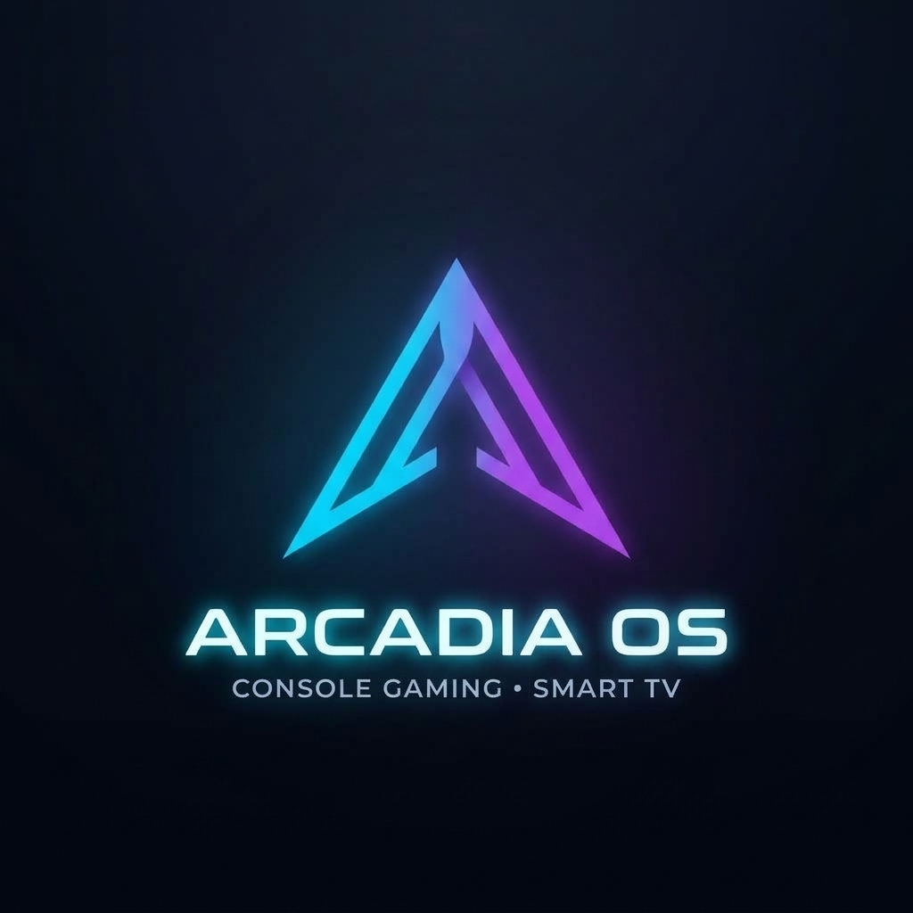

<p align="center">
  
</p>

<h1 align="center">ArcadiaOS 🏛️🎮📺</h1>

<p align="center">
  <strong>The Living Room Powerhouse</strong>: Unified PC Console Experience & Native Smart TV Runtime.
</p>

<p align="center">
  
  
  
  
</p>

---

**ArcadiaOS** is an open-source project designed to turn any PC into the ultimate living room console and media center. Built on top of immutable gaming Linux foundations (like Bazzite), ArcadiaOS seamlessly bridges high-performance AAA PC gaming with a dedicated, hardware-accelerated **Android TV runtime (Waydroid Leanback)** for native smart TV streaming apps, full D-pad remote navigation, and hardware spoofing for uncompromised media playback.


---

## 🌟 Key Features

* **🔀 Arcadia Dual Portal (Boot Selector):** Splitscreen startup UI on boot to choose between **JOGOS** and **SMART TV** with Gamepad or TV Remote.
* **🎮 Native PC Gaming (Console Mode):** Boots straight into full-screen Game Mode with low-latency controller support, suspend/resume, and native GPU acceleration (Nvidia & AMD).
* **📺 Real Android TV Interface:** Runs genuine Android TV applications (Projectivy Launcher, SmartTube 4K, TV streaming APKs) designed specifically for 10-foot TV viewing.
* **🏪 Native TV App Stores:** Built-in Google Play Store (GApps with Play Protect certification) and Aurora Store TV for zero-friction TV APK downloads.
* **🕹️ Bluetooth Remote Control First:** Full out-of-the-box support for Bluetooth TV remotes (such as the standard G9N9N Bluetooth remote).
* **⚡ ARM-to-x86 Translation (`libndk`):** Seamlessly executes ARMv7 / ARM64 Android TV APKs on standard x86_64 PC processors.
* **🛡️ Hardware Identity Spoofing:** Injects certified TV hardware profiles (NVIDIA SHIELD TV `mdarcy`) to unlock the official TV catalog from the Play Store.
* **🪟 Automated UEFI Dual-Boot:** Auto-detects your existing Windows installation, adds it to the GRUB boot menu with 1080p/4K resolution for TVs, and remembers your last boot choice.
* **💾 Safe Secondary Drive Installation:** Installs cleanly on a secondary HDD or SSD without altering your primary Windows drive.

---

## 📁 Repository Structure

```text
arcadia-os/
├── bin/
│   ├── arcadia-launcher.sh         # Launcher session handler for Waydroid TV
│   └── arcadia-portal.sh           # Kiosk launcher for the Boot Selector
├── config/
│   ├── arcadia-portal.desktop      # Autostart entry for the boot selector
│   ├── arcadia-tv.desktop          # Application entry for Game Mode / Desktop
│   ├── shield-props.prop           # Hardware spoofing profile (NVIDIA Shield TV)
│   └── 99-bt-remote.rules          # Low-latency udev rules for Bluetooth remotes
├── portal/
│   ├── index.html                  # Responsive 4K Split-Screen UI (Gamepad + Remote)
│   └── server.py                   # Lightweight Python bridge and API server
├── scripts/
│   ├── install.sh                  # Interactive Master Installer (1-click)
│   ├── setup-dualboot.sh           # Automated Windows UEFI dual-boot configurator
│   ├── setup-waydroid-tv.sh        # Automated Android TV container provisioning
│   └── setup-remote.sh             # Bluetooth TV remote pairing assistant
├── LICENSE                         # MIT Open Source License
└── README.md                       # Main documentation
```

---

## 🛠️ Quick Installation (on Bazzite Linux)

Once you boot into Bazzite on your target machine:
1. Switch to **Desktop Mode**.
2. Open the terminal (**Konsole**) and run:

```bash
git clone https://github.com/JMoraaeess/arcadia-os.git
cd arcadia-os
chmod +x scripts/install.sh
./scripts/install.sh
```

Ou via comando rápido de uma linha:
```bash
curl -fsSL https://raw.githubusercontent.com/JMoraaeess/arcadia-os/main/scripts/install.sh | bash
```

---

## 🎮 Recommended Hardware Setup

| Component | Recommendation |
| :--- | :--- |
| **GPU** | NVIDIA GeForce (GTX 1060+ / RTX) or AMD Radeon |
| **Storage** | Dedicated 500GB - 1TB+ SSD or HDD |
| **Controller** | Standard Gamepad (Xbox / PlayStation) for Gaming |
| **Remote** | Bluetooth TV Remote (G9N9N or compatible BLE remote) |
| **Connectivity** | Bluetooth 4.2+ & Ethernet / Wi-Fi |

---

## 📄 License & Legal Disclaimer

Distributed under the MIT License. See `LICENSE` for more information.

> [!NOTE]
> **Trademarks & Disclaimer:**  
> Steam, SteamOS, and Steam Deck are trademarks or registered trademarks of Valve Corporation.  
> Android, Google Play, and Android TV are trademarks of Google LLC.  
> NVIDIA and SHIELD are trademarks or registered trademarks of NVIDIA Corporation.  
> ArcadiaOS is an independent, community-driven open-source project. It is not affiliated with, endorsed by, or sponsored by Valve Corporation, Google LLC, NVIDIA Corporation, or any other trademark holder mentioned herein.

